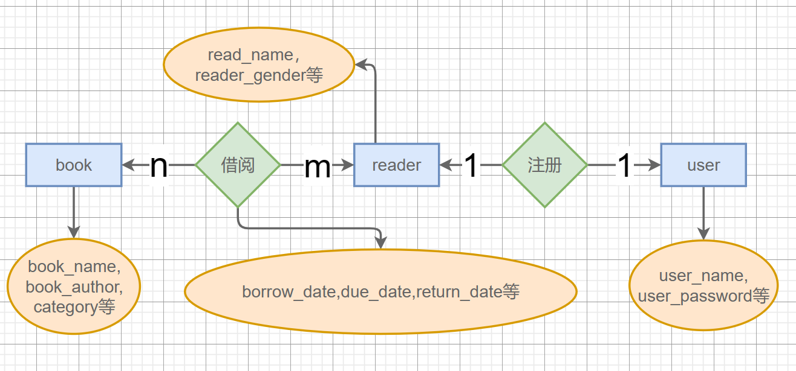
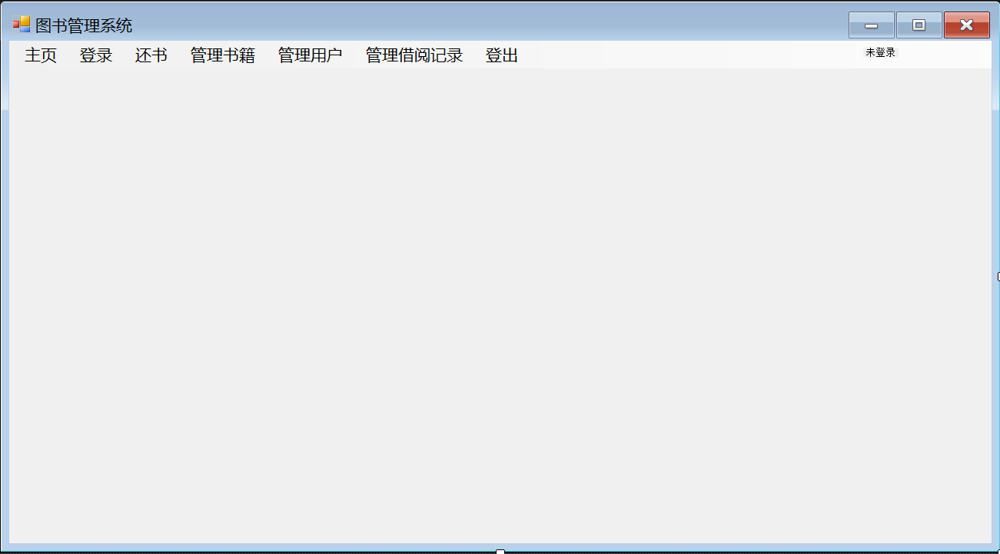
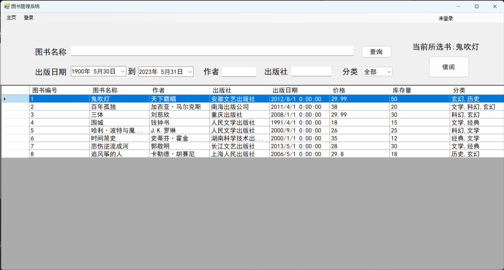
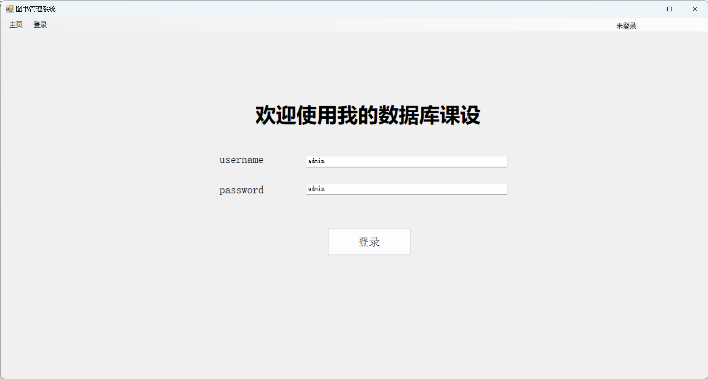
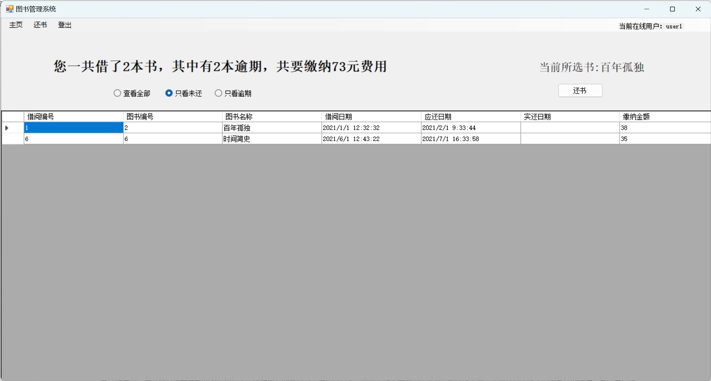
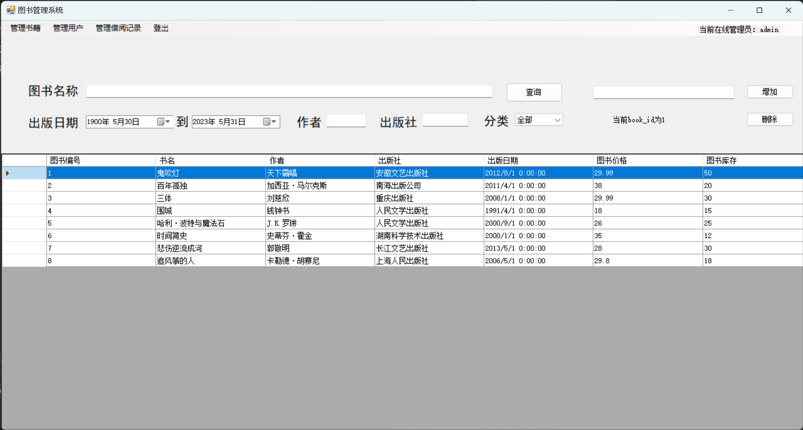
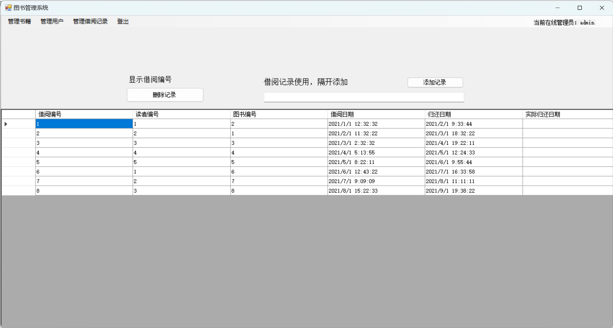

## 图书馆管理系统

### 功能

1. 读者、图书及相关信息的维护;
2. 可以实现读者的借书，还书的操作;
3. 借书时需要根据读者的类别对于借书的数量及期限自动做限制;
4. 还书时根据以上限制显示是否超期，超期罚款应为多少:
5. 可进行各种查询操作，方便读者查找图书;
6. 可进行查询统计操作，方便工作人员统计借阅情况；


其中，基础数据维护包括读者、图书及相关信息的录入、修改、删除、查询;借书管理包括借书信息的录入、删除、修改、查询以及相关统计查询等;还书管理包括还书和超期信息的录入、删除、修改、查询以及相关统计查询等;用户管理包括用户、用户组、权限的录入、修改、删除、查询以及权限分配、用户登录等功能。

### E-R图的设计

各个表格主键都设置为一个自动增长的索引



### 关系模型的设计

将 E-R 图转化为关系模型的过程称为**关系规范化**（Normalization）。

**将实体转化为关系模型表**：将 E-R 图中的每个实体转化为一个关系模型表，表中包含该实体的所有属性，将实体的主键作为该表的主键。

**将关系转化为关系模型表**：将 E-R 图中的关系转化为关系模型表。如果一个关系是一对一关系，则可以选择在任意一张表中添加一个外键指向另一张表；如果一个关系是一对多或多对多关系，则需要创建第三张关联表。关联表中一般只包含两个外键，分别指向关联的两个表的主键。

**消除冗余数据**：在完成上述步骤后，需要检查关系模型表中是否存在冗余数据。如果存在冗余数据，则需要进行关系规范化，将冗余数据分解为多个符合要求的表。一般来说，关系规范化是一个迭代的过程，需要不断检查和修改关系模型，直到满足要求。

最终得到下表：

| 表                   | 描述                                                         | 属性                                                         |
| :------------------- | ------------------------------------------------------------ | ------------------------------------------------------------ |
| 用户表（user）       | 存储系统用户的信息，包括用户编号、用户名、密码、用户权限等字段。 | **user_id**, user_name, user_password, user_permission       |
| 读者表（reader）     | 存储读者的个人信息，包括读者编号、姓名、性别、联系电话、借阅权限、用户编号等字段。 | **reader_id**, reader_name, reader_gender, reader_tel, *user_id* |
| 图书表（book）       | 存储图书的基本信息，包括图书编号、图书名称、作者、出版社、出版日期、价格、库存量等字段。 | **book_id**, book_name, book_author, book_publisher, book_publish_date, book_price, book_stoc |
| 借阅记录表（borrow） | 存储图书借阅的记录信息，包括借阅编号、读者编号、图书编号、借阅日期、应还日期、实还日期等字段。 | **borrow_id**, *reader_id*, *book_id*, borrow_date, due_date, return_date |
| 类别表（category）   | 存储图书的分类信息，包括分类编号、分类名称等字段。           | **category_id**, category_name                               |
| 图书-分类关系表      | 图书和分类是多对多关系，使用一张中间表连接                   | **id**,*book_id*,*category_id*                               |

设计关系模型时我在考虑是把用户和管理员放到两张表里，用户拥有读者应该有的所有属性，还是把用户和管理员放到一张表里，用`premission`字段区分管理员和用户，再通过添加外键关联读者。我选择了第二种做法。

### 开发过程

#### 创建数据库

创建`sql server`服务器容器

```
docker pull mcr.microsoft.com/mssql/server:2022-latest
docker run -e "ACCEPT_EULA=Y" -e "SA_PASSWORD=2019chance." -p 1433:1433 --name sql2022 -d mcr.microsoft.com/mssql/server:2022-latest
docker ps 
```

连接时候服务器名称填写`localhost,1433`,身份验证选择`sql server`身份验证，登录名是默认创建的`SA`，密码是创建容器时候设置的密码。

创建数据库：

```sql
CREATE DATABASE LibraryManagement;
--支持中文
ALTER DATABASE LibraryManagement COLLATE Chinese_PRC_CI_AS; 
USE LibraryManagement;
```

创建数据模型：`ON DELETE CASCADE`级联删除，当外键指向的那个模型记录被删除时，会一并删除当前表关联的记录。

```sql
CREATE TABLE [user] (
    user_id INT IDENTITY(1,1) PRIMARY KEY,
    user_name VARCHAR(50),
    user_password VARCHAR(50),
    user_permission INT
);

CREATE TABLE reader (
    reader_id INT IDENTITY(1,1) PRIMARY KEY,
    reader_name VARCHAR(50),
    reader_gender VARCHAR(10),
    reader_tel VARCHAR(20),
    user_id INT,
    FOREIGN KEY (user_id) REFERENCES [user](user_id) ON DELETE CASCADE
);

CREATE TABLE book (
    book_id INT IDENTITY(1,1) PRIMARY KEY,
    book_name VARCHAR(100),
    book_author VARCHAR(50),
    book_publisher VARCHAR(50),
    book_publish_date DATETIME,
    book_price FLOAT,
    book_stock INT
);

CREATE TABLE borrow (
    borrow_id INT IDENTITY(1,1) PRIMARY KEY,
    reader_id INT,
    book_id INT,
    borrow_date DATETIME,
    due_date DATETIME,
    return_date DATETIME,
    FOREIGN KEY (reader_id) REFERENCES reader(reader_id) ON DELETE CASCADE,
    FOREIGN KEY (book_id) REFERENCES book(book_id) ON DELETE CASCADE
);

CREATE TABLE category (
    category_id INT IDENTITY(1,1) PRIMARY KEY,
    category_name VARCHAR(50)
);

CREATE TABLE book_category (
    id INT IDENTITY(1,1) PRIMARY KEY,
    book_id INT,
    category_id INT,
    FOREIGN KEY (book_id) REFERENCES book(book_id) ON DELETE CASCADE,
    FOREIGN KEY (category_id) REFERENCES category(category_id) ON DELETE CASCADE
);
```

添加一些视图，屏蔽掉复杂的原始查询。复习：视图是基本表的映射，每次使用视图都会执行查询，不占内存；更新视图更新的是基本表，类似引用赋值。但是个人觉得视图并不是那么的好用，因为它不能传递参数。

```sql
CREATE VIEW all_books AS 
SELECT b.*, STRING_AGG(c.category_name, ',') AS categories 
FROM book b LEFT JOIN book_category bc ON b.book_id = bc.book_id 
LEFT JOIN category c ON bc.category_id = c.category_id 
GROUP BY b.book_id, b.book_name, b.book_author, b.book_publisher, b.book_publish_date, b.book_price, b.book_stock;
```

创建测试数据

```sql
-- 测试数据 for [user]
INSERT INTO [user] (user_name, user_password, user_permission) VALUES 
('admin', 'admin', 1),
('user1', 'password1', 0),
('user2', 'password2', 0),
('user3', 'password3', 0);

-- 测试数据 for reader
INSERT INTO reader (reader_name, reader_gender, reader_tel, user_id) VALUES 
('张三', '男', '12345678901', 2),
('李四', '女', '13912345678', 3),
('王五', '男', '18888888888', 4);

-- 测试数据 for book
INSERT INTO book (book_name, book_author, book_publisher, book_publish_date, book_price, book_stock) VALUES 
('鬼吹灯', '天下霸唱', '安徽文艺出版社', '2012-08-01', 29.99, 50),
('百年孤独', '加西亚·马尔克斯', '南海出版公司', '2011-04-01', 38.00, 20),
('三体', '刘慈欣', '重庆出版社', '2008-01-01', 29.99, 30),
('围城', '钱钟书', '人民文学出版社', '1991-04-01', 18.00, 15);

-- 测试数据 for borrow
INSERT INTO borrow (reader_id, book_id, borrow_date, due_date, return_date) VALUES 
(1, 2, '2021-01-01 12:32:32', '2021-02-01 09:33:44', null),
(2, 1, '2021-02-01 11:32:22', '2021-03-01 18:32:22', null),
(3, 3, '2021-03-01 02:32:32', '2021-04-01 19:22:11', null);

-- 测试数据 for category
INSERT INTO category (category_name) VALUES 
('玄幻'),
('文学'),
('科幻');

-- 测试数据 for book_category
INSERT INTO book_category (book_id, category_id) VALUES 
(1, 1),
(2, 2),
(3, 3),
(2, 3),
(4, 2);
```

#### 封装`sql`连接

创建一个类，用于封装`SqlConnection`和`SqlCommad`

```c#
namespace mynamespace
{

    internal class Connectsql
    {
        String str = "Server=localhost,1433;Database=LibraryManagement;User Id=sa;Password=2019chance.;";
        SqlConnection con;
        public Connectsql()
        {
            con = new SqlConnection(str);
            con.Open();
        }
        public bool Close()
        {
            con.Close();
            return true;
        }
        
        public int excutesql(string sql)
        {
            SqlCommand cmd = new SqlCommand(sql, con);
            int rowsAffected = cmd.ExecuteNonQuery();
            return rowsAffected;
        }

        public SqlDataReader excutesql(string sql,bool usereader)
        {
            SqlCommand cmd = new SqlCommand(sql, con);
            SqlDataReader reader = cmd.ExecuteReader();
            return reader;
        }
    }
}
```

#### 主窗口

添加主`Form`，根据具体登录状态隐藏菜单栏和各个子组件，添加菜单点击事件有选择的显示隐藏子组件。



非常简单粗暴的存状态方法，直接在主`Form`里增加账号密码属性。`controls`用于存放各个子组件，在创建子组件实例的时候把当前实例的`this`指针赋给它，这样可以在子组件中调用父组件的方法。要注意在执行构造函数时候`this`才指向当前实例。

```c#
public partial class MainForm : Form
    {
        //存子组件
        public UserControl[] controls = new UserControl[6];
        //直接赋值，无需实例化，用到this要在构造函数中赋值，因为this在实例化后才指向当前实例
        public String userid = "";
        public String username = "";
        public String premission = "";
        public String readerid = "";
        public MainForm()
        {
            InitializeComponent();
            //这里this就已经指向当前实例了
            controls[0] = new WelcomeForm(this);
            controls[1] = new loginForm(this);
            controls[2] = new returnForm(this);
            controls[3] = new BookForm(this);
            controls[4] = new UserForm(this);
            controls[5] = new BorrowForm(this);
        }

        public void switchForm(int showform)
        {
            //切换界面
            int j = 0;
            foreach(UserControl i in controls)
            {
                if (j == showform)
                    i.Show();
                else
                    i.Hide();
                j++;
            }
        }
        private void switchButtom(int[] showbuttom)
        {
            foreach (ToolStripMenuItem item in menuStrip1.Items)
            {
                item.Visible = false;
            }
            for (int i=0;i<showbuttom.Length;i++)
            {
                int sho = showbuttom[i];
                menuStrip1.Items[sho].Visible = true;
            }
        }
        private void MainForm_Load(object sender, EventArgs e)
        {
            //添加子组件
            foreach(UserControl i in controls)
            {
                i.Hide();
                i.Location = new Point(0, 0);
                this.Controls.Add(i);
            }
            //初始化页面展示
            int[] buttomint={ 0,1 };
            switchButtom(buttomint);
            int[] formint = { 0 };
            switchForm(0);
        }

        public void set_label(String s)
        {
            label1.Text = s;
        }

        public void switchall(String s)
        {
            //根据权限修改页面内容
            if (s == "1")
            {
                int[] ints = {3, 4, 5 ,6};
                switchButtom(ints);
                switchForm(3);
            }
            else
            {
                int[] ints = { 0, 2, 6};
                switchButtom(ints);
                switchForm(0);
            }
        }

        private void 主页ToolStripMenuItem_Click(object sender, EventArgs e)
        {
            //主页无需重新获取数据
            switchForm(0);
        }
        private void 登录ToolStripMenuItem_Click(object sender, EventArgs e)
        {
            switchForm(1);
        }
        private void 还书ToolStripMenuItem_Click(object sender, EventArgs e)
        {
            //不能让其他用户看见你的视图，切换到这个视图时重新获取下数据
            ((returnForm)controls[2]).get_data();
            switchForm(2);
        }

        private void 登出ToolStripMenuItem_Click(object sender, EventArgs e)
        {
            int[] buttomint = { 0, 1 };
            switchButtom(buttomint);
            int[] formint = { 0 };
            switchForm(1);

            userid =username =premission = readerid = "";
            set_label("未登录");

    }

        private void 管理书籍ToolStripMenuItem_Click(object sender, EventArgs e)
        {
            ((BookForm)controls[3]).get_data();
            switchForm(3);
        }

        private void 管理用户ToolStripMenuItem_Click(object sender, EventArgs e)
        {
            switchForm(4);
        }

        private void 管理借阅记录ToolStripMenuItem_Click(object sender, EventArgs e)
        {
            switchForm(5);
        }

    }
```

#### 欢迎控件

借书控件，作为`UserControl`可以被嵌入到主`form`



以下为代码实现

```c#
 public partial class WelcomeForm : UserControl
{
    MainForm f;
    String book_id;
    public WelcomeForm(MainForm f)
    {
        InitializeComponent();
        this.f = f;

    }

    public String[] GetStringArray(SqlDataReader reader)
    {
        List<string> stringList = new List<string>();
        for (int i = 0; i < reader.FieldCount; i++)
        {
            stringList.Add(reader[i].ToString());
        }
        return stringList.ToArray();
    }
    private void WelcomePage_Load(object sender, EventArgs e)
    {

        //comboBox1
        Connectsql cons = new Connectsql();
        SqlDataReader reader = cons.excutesql("SELECT category_name FROM category", true);
        comboBox1.Items.Add("全部");
        while (reader.Read())
        {
            comboBox1.Items.Add(reader[0].ToString());
        }
        comboBox1.SelectedIndex = 0;
        reader.Close();
        cons.Close();

        //dataGridView1
        get_data();
    }


    public void get_data()
    {
        DateTime fromdate = dateTimePicker1.Value;
        DateTime todate = dateTimePicker2.Value;
        String maintext = textBox1.Text;
        String author = textBox2.Text;
        String publisher = textBox3.Text;
        String category = comboBox1.Text.ToString();
        dataGridView1.Rows.Clear();

        String sql = $"SELECT * FROM all_books WHERE book_id IN (SELECT book_id FROM book WHERE (book_name LIKE '%{maintext}%' AND book_author LIKE '%{author}%' AND book_publisher LIKE '%{publisher}%' AND book_publish_date >= '{fromdate}' AND book_publish_date <= '{todate}'));";
        if (category != "全部")
        {
            sql = $"SELECT * FROM all_books WHERE book_id IN (SELECT book_id FROM book WHERE (book_name LIKE '%{maintext}%' AND book_author LIKE '%{author}%' AND book_publisher LIKE '%{publisher}%' AND book_publish_date >= '{fromdate}' AND book_publish_date <= '{todate}' AND book_id in (SELECT book_id FROM book_category WHERE category_id in (SELECT category_id FROM category WHERE category_name='{category}'))));";
        }
        Connectsql cons = new Connectsql();
        SqlDataReader reader = cons.excutesql(sql, true);

        while (reader.Read())
        {
            dataGridView1.Rows.Add(GetStringArray(reader));
        }
        reader.Close();
        cons.Close();
    }
    private void button1_Click(object sender, EventArgs e)
    {
        get_data();
    }

    private void dataGridView1_SelectionChanged(object sender, EventArgs e)
    {
        // 获取当前所选行的第二个属性的值
        string secondColumnValue = dataGridView1.CurrentRow.Cells[1].Value.ToString();
        label7.Text="当前所选书:"+secondColumnValue;
        book_id = dataGridView1.CurrentRow.Cells[0].Value.ToString();
    }

    private void button2_Click(object sender, EventArgs e)
    {
        if (f.username == "")
        {
            MessageBox.Show("请先登录");
            f.switchForm(1);
        }
        else
        {
            Connectsql cons = new Connectsql();
            SqlDataReader reader;
            //查询图书数量
            reader = cons.excutesql($"SELECT book_stock FROM book WHERE book_id={book_id};", true);
            reader.Read();
            int book_stock = int.Parse(reader[0].ToString());
            reader.Close();
            //查询借了几本书
            reader = cons.excutesql($"SELECT COUNT(*) as borrowed_count FROM borrow  WHERE reader_id = '{f.readerid}' AND return_date IS NULL;", true);
            reader.Read();
            int borrowed_count = int.Parse(reader[0].ToString());
            reader.Close();
            if (book_stock==0)
            {
                MessageBox.Show("图书库存不足");
            }
            else if ( borrowed_count> 2)
            {
                MessageBox.Show("最大借阅3本书");
            }
            else
            {
                MessageBox.Show("借书成功");
                //插入记录
                cons.excutesql($"INSERT INTO borrow (reader_id, book_id, borrow_date, due_date) VALUES ({f.readerid}, {book_id}, GETDATE(), DATEADD(month, 1, GETDATE()));");
                //减少图书库存
                cons.excutesql($"UPDATE book SET book_stock = book_stock - 1 WHERE book_id = {book_id};");
                //更新视图
                get_data();
            }
            cons.Close();
        }
    }
}
```

重点说一说使用到的`sql`语句：这段`sql`语句用到了`sql server`的一个将一列值拼接为字符串的聚合函数，要注意顺序`JOIN`再`WHERE`后`GROUP BY`最后`HAVING`。

```sql
--分组查询，聚合函数，联接查询
SELECT b.*, STRING_AGG(c.category_name, ',') AS categories 
FROM book b LEFT JOIN book_category bc ON b.book_id = bc.book_id 
LEFT JOIN category c ON bc.category_id = c.category_id 
GROUP BY b.book_id, b.book_name, b.book_author, b.book_publisher, b.book_publish_date, b.book_price, b.book_stock;
```

下面这段`sql`语句使用了`LIKE`模糊匹配，`=`只能精确匹配字符串。`LIKE`和正则表达式差不多，但默认的会匹配开头结尾，要加上`%`匹配0个或多个字符串。而正则表达式不会匹配开头结尾，但可以在开头结尾加上`^`和`$` 匹配开头结尾。它还使用了子查询。

```sql
--LIKE模糊匹配，日期比较大小，嵌套查询
SELECT * FROM all_books WHERE book_id IN 
(SELECT book_id FROM book WHERE 
(book_name LIKE '%{maintext}%' AND book_author LIKE '%{author}%' AND book_publisher LIKE '%{publisher}%' AND 
book_publish_date >= '{fromdate}' AND book_publish_date <= '{todate}'));
```

如果有用到`GROUP BY`，想筛选分组后的结果只能用`HAVING`。但因为如果把`GROUP BY`的结果保存为了视图，就只需要用`WHERE`从视图中筛选即可。比如上下两段`sql`其实都是。

```sql
--
SELECT * FROM all_books WHERE book_id IN (
SELECT book_id FROM book 
WHERE (book_name LIKE '%{maintext}%' AND book_author LIKE '%{author}%' AND book_publisher LIKE '%{publisher}%' 
       AND book_publish_date >= '{fromdate}' AND book_publish_date <= '{todate}' 
       AND book_id in (SELECT book_id FROM book_category WHERE category_id in 
                       (SELECT category_id FROM category WHERE category_name='{category}'))));
```

`GETDATE`和`GETADD`是`sql server`中才有的时间函数，`mysql`中的和它不一样，要注意`GETDATE`获得的时间是`UTC`时间。

```sql
--GETDATE 
INSERT INTO borrow (reader_id, book_id, borrow_date, due_date) VALUES ({reader_id}, {book_id}, GETDATE(), DATEADD(month, 1, GETDATE()));
```

#### 登录控件



在主`Form`内添加该组件，这个子组件的登录被点击后会在数据库查找有没有当前用户，有就执行登录函数，把id，用户名和权限传给主`Form`并修改页面。

这里用到的`sql`语句中`[]`是为了防止标识符与 `sql`关键字冲突

```sql
SELECT user_name,user_permission,user_id FROM [user] WHERE user_name='{username}' AND user_password='{password}';
```

以下为组件代码。

```c#
public partial class loginForm : UserControl
{
    MainForm f;
    public loginForm(MainForm f)
    {
        InitializeComponent();
        this.f = f;
    }

    private void loginForm_Load(object sender, EventArgs e)
    {

    }

    private void button1_Click(object sender, EventArgs e)
    {
        Connectsql cons = new Connectsql();
        SqlDataReader reader;
        String username = textBox1.Text;
        String password = textBox2.Text;
        reader = cons.excutesql($"SELECT user_name,user_permission,user_id FROM [user] WHERE user_name='{username}' AND user_password='{password}';", true);
        if (reader.Read())
        {
            login(reader[0].ToString(), reader[1].ToString(),reader[2].ToString());
        }
        else
        {
            MessageBox.Show("登录失败");
        }
        reader.Close();
        cons.Close();
    }

    private void login(String username,String premission,String userid)
    {
        //设置label
        if (premission == "0")
        {
            f.set_label("当前在线用户：" + username);
            //查询reader_id
            Connectsql cons = new Connectsql();
            SqlDataReader reader = cons.excutesql($"SELECT reader_id FROM reader WHERE user_id={userid};", true);
            reader.Read();
            String reader_id = reader[0].ToString();
            reader.Close();
            f.readerid = reader_id;
        }
        else
            f.set_label("当前在线管理员：" + username);
        //设置主form属性
        f.username = username;
        f.premission = premission;
        f.userid = userid;
        //修改界面内容
        f.switchall(premission);
    }
}
```

#### 还书控件

用户在登录后就可进入当前页面



以下为代码实现

```c#
public partial class returnForm : UserControl
{
    MainForm f;
    String borrow_id;
    String book_id;

    public returnForm(MainForm f)
    {
        InitializeComponent();
        this.f = f;
    }

    private void button1_Click(object sender, EventArgs e)
    {
        //修改记录并把书库存+1
        Connectsql cons = new Connectsql();
        int d=cons.excutesql($"UPDATE borrow SET return_date = GETDATE() WHERE borrow_id={borrow_id};");
        cons.excutesql($"UPDATE book SET book_stock = book_stock + 1 WHERE book_id = {book_id};");
        cons.Close();
        MessageBox.Show("归还成功");
        get_data();


    }
    public String[] GetStringArray(SqlDataReader reader)
    {
        List<string> stringList = new List<string>();
        for (int i = 0; i < reader.FieldCount; i++)
        {
            stringList.Add(reader[i].ToString());
        }
        return stringList.ToArray();
    }
    private void returnForm_Load(object sender, EventArgs e)
    {
    }
    public void get_data()
    {
        Connectsql cons = new Connectsql();
        SqlDataReader reader;
        String sql = "";
        if (radioButton1.Checked)
        {
            sql = $"SELECT borrow_id, book.book_id,(SELECT book_name FROM book WHERE borrow.book_id=book.book_id ),borrow_date, due_date, return_date,CASE WHEN return_date IS NULL AND GETDATE()>=due_date THEN LEAST(DATEDIFF(day,due_date, GETDATE()),50)*0.02*book_price WHEN return_date IS NULL THEN 0 WHEN return_date>=due_date THEN LEAST(DATEDIFF(day,due_date, return_date),50)*0.02*book_price ELSE 0 END AS Default_fee FROM borrow LEFT JOIN book ON book.book_id=borrow.book_id WHERE reader_id={f.readerid}";
        }else if(radioButton2.Checked)
        {
            sql = $"SELECT borrow_id, book.book_id,(SELECT book_name FROM book WHERE borrow.book_id=book.book_id ),borrow_date, due_date, return_date,CASE WHEN return_date IS NULL AND GETDATE()>=due_date THEN LEAST(DATEDIFF(day,due_date, GETDATE()),50)*0.02*book_price WHEN return_date IS NULL THEN 0 WHEN return_date>=due_date THEN LEAST(DATEDIFF(day,due_date, return_date),50)*0.02*book_price ELSE 0 END AS Default_fee FROM borrow LEFT JOIN book ON book.book_id=borrow.book_id WHERE reader_id={f.readerid} AND return_date IS NULL";
        }else if (radioButton3.Checked)
        {
            sql = $"SELECT borrow_id, book.book_id,(SELECT book_name FROM book WHERE borrow.book_id=book.book_id ),borrow_date, due_date, return_date,CASE WHEN return_date IS NULL AND GETDATE()>=due_date THEN LEAST(DATEDIFF(day,due_date, GETDATE()),50)*0.02*book_price WHEN return_date IS NULL THEN 0 WHEN return_date>=due_date THEN LEAST(DATEDIFF(day,due_date, return_date),50)*0.02*book_price ELSE 0 END AS Default_fee FROM borrow LEFT JOIN book ON book.book_id=borrow.book_id WHERE reader_id={f.readerid} AND return_date IS NULL AND due_date<GETDATE();";
        }
        reader = cons.excutesql(sql, true);
        dataGridView1.Rows.Clear();
        while (reader.Read())
        {
            dataGridView1.Rows.Add(GetStringArray(reader));
        }
        reader.Close();
        //count1
        reader = cons.excutesql($"SELECT COUNT(*) FROM borrow WHERE return_date IS NULL AND reader_id={f.readerid}", true);
        reader.Read();
        int count1 = int.Parse(reader[0].ToString());
        reader.Close();
        //count2
        reader = cons.excutesql($"SELECT COUNT(*) FROM borrow WHERE return_date IS NULL AND reader_id={f.readerid} AND due_date<GETDATE();", true);
        reader.Read();
        int count2 = int.Parse(reader[0].ToString());
        reader.Close();
        //count3
        reader = cons.excutesql($"SELECT ISNULL(SUM(book_price*LEAST(0.02 * DATEDIFF(day, due_date, GETDATE()),1)),0) AS total_fee FROM borrow JOIN book ON borrow.book_id = book.book_id WHERE reader_id = {f.readerid} AND due_date < GETDATE() AND return_date IS NULL;", true);
        reader.Read();
        float count3 = float.Parse(reader[0].ToString());

        label1.Text = $"您一共借了{count1}本书，其中有{count2}本逾期，共要缴纳{count3}元费用";
        cons.Close();
    }

    private void radioButton3_CheckedChanged(object sender, EventArgs e)
    {

            get_data();
    }

    private void radioButton2_CheckedChanged(object sender, EventArgs e)
    {

            get_data();
    }

    private void radioButton3_CheckedChanged_1(object sender, EventArgs e)
    {

            get_data();
    }

    private void dataGridView1_SelectionChanged(object sender, EventArgs e)
    {
        string secondColumnValue = dataGridView1.CurrentRow.Cells[2].Value.ToString();
        label2.Text = "当前所选书:" + secondColumnValue;
        borrow_id = dataGridView1.CurrentRow.Cells[0].Value.ToString();
        book_id= dataGridView1.CurrentRow.Cells[1].Value.ToString();
    }
}
```

#### 图书管理控件

只有管理员能看到当前界面



以下为代码实现

```c#
public partial class BookForm : UserControl
{
    MainForm f;
    int rolls;
    String book_id;
    public BookForm(MainForm f)
    {
        InitializeComponent();
        this.f = f;
    }
    public String[] GetStringArray(SqlDataReader reader)
    {
        List<string> stringList = new List<string>();
        for (int i = 0; i < reader.FieldCount; i++)
        {
            stringList.Add(reader[i].ToString());
        }
        return stringList.ToArray();
    }
    public void get_data()
    {
            DateTime fromdate = dateTimePicker1.Value;
            DateTime todate = dateTimePicker2.Value;
            String maintext = textBox1.Text;
            String author = textBox2.Text;
            String publisher = textBox3.Text;
            String category = comboBox1.Text.ToString();
            dataGridView1.Rows.Clear();
            rolls = 0;

            String sql = $"SELECT * FROM book WHERE book_id IN (SELECT book_id FROM book WHERE (book_name LIKE '%{maintext}%' AND book_author LIKE '%{author}%' AND book_publisher LIKE '%{publisher}%' AND book_publish_date >= '{fromdate}' AND book_publish_date <= '{todate}'));";
            if (category != "全部")
            {
                sql = $"SELECT * FROM book WHERE book_id IN (SELECT book_id FROM book WHERE (book_name LIKE '%{maintext}%' AND book_author LIKE '%{author}%' AND book_publisher LIKE '%{publisher}%' AND book_publish_date >= '{fromdate}' AND book_publish_date <= '{todate}' AND book_id in (SELECT book_id FROM book_category WHERE category_id in (SELECT category_id FROM category WHERE category_name='{category}'))));";
            }
            Connectsql cons = new Connectsql();
            SqlDataReader reader = cons.excutesql(sql, true);

            while (reader.Read())
            {
                dataGridView1.Rows.Add(GetStringArray(reader));
                rolls++;
            }
            reader.Close();
            cons.Close();
    }

    private void BookForm_Load(object sender, EventArgs e)
    { 
        //comboBox1
        Connectsql cons = new Connectsql();
        SqlDataReader reader = cons.excutesql("SELECT category_name FROM category", true);
        comboBox1.Items.Add("全部");
        while (reader.Read())
        {
            comboBox1.Items.Add(reader[0].ToString());
        }
        comboBox1.SelectedIndex = 0;
        reader.Close();
        cons.Close();

        //dataGridView1
        get_data();
    }

    private void button1_Click(object sender, EventArgs e)
    {
        get_data();
    }

    private void dataGridView1_CellValueChanged(object sender, DataGridViewCellEventArgs e)
    {   
        //表格被修改后触发，从第一条记录为0开始
        if (e.RowIndex >= 0&&e.RowIndex<rolls)
        {
            int rowIndex = e.RowIndex;
            int columnIndex = e.ColumnIndex;
            String[] s = { "book_id", "book_name", "book_author", " book_publisher", "book_publish_date", "book_price", "book_stock"};
            // 根据行和列索引获取单元格的值
            DataGridViewCell cell = dataGridView1[columnIndex, rowIndex];
            //没填就用null代替插入
            String value;
            if (cell.Value == null)
                value = "null";
            else
                value = $"'{cell.Value.ToString()}'";
            Connectsql cons = new Connectsql();
            cons.excutesql($"UPDATE book SET {s[columnIndex]} = '{value}' WHERE book_id = {book_id};");
            cons.Close();
            MessageBox.Show("值已成功修改为"+value);
            get_data();
        }
    }

    private void dataGridView1_SelectionChanged(object sender, EventArgs e)
    {
        //index从第一行记录开始，为0
        if (dataGridView1.CurrentRow.Index < rolls)
        {
            book_id = dataGridView1.CurrentRow.Cells[0].Value.ToString();
            label1.Text = "当前book_id为"+book_id;
        }
    }

    private void button2_Click(object sender, EventArgs e)
    {
        Connectsql cons = new Connectsql();
        cons.excutesql($"DELETE FROM book WHERE book_id={book_id};");
        cons.Close();
        MessageBox.Show("编号为"+book_id + "的书被删除");
        get_data();

    }

    private void button3_Click(object sender, EventArgs e)
    {
        String s = textBox4.Text;
        String[] s_split = s.Split('，');
        String res = "(";
        for (int index = 0; index < s_split.Length; index++)
        {
            if (s_split[index] == "null")
                res += "null";
            else
                res += $"'{s_split[index]}'";
            if (index != s_split.Length - 1)
            {
                res += ',';
            }
        }
        res += ')';
        Connectsql cons = new Connectsql();
        cons.excutesql($"INSERT INTO book (book_name, book_author, book_publisher, book_publish_date, book_price, book_stock) VALUES {res}");
        cons.Close();
        MessageBox.Show(res+"已经成功添加");
        get_data();
    }
}
```

#### 管理用户控件

偷懒了，没写

#### 管理借阅控件



```c#
public partial class BorrowForm : UserControl
{
    MainForm f;
    int rolls;
    String borrow_id;
    public BorrowForm(MainForm f)
    {
        InitializeComponent();
        this.f = f;
    }
    public String[] GetStringArray(SqlDataReader reader)
    {
        List<string> stringList = new List<string>();
        for (int i = 0; i < reader.FieldCount; i++)
        {
            stringList.Add(reader[i].ToString());
        }
        return stringList.ToArray();
    }
    public void get_data()
    {
        dataGridView1.Rows.Clear();
        rolls = 0;
        String sql = "SELECT * FROM borrow;";
        Connectsql cons = new Connectsql();
        SqlDataReader reader = cons.excutesql(sql, true);
        while (reader.Read())
        {
            dataGridView1.Rows.Add(GetStringArray(reader));
            rolls++;
        }
        reader.Close();
        cons.Close();
    }
    private void BorrowForm_Load(object sender, EventArgs e)
    {
        get_data();
    }

    private void dataGridView1_SelectionChanged(object sender, EventArgs e)
    {
        //index从第一行记录开始，为0
        if (dataGridView1.CurrentRow.Index < rolls)
        {
            borrow_id = dataGridView1.CurrentRow.Cells[0].Value.ToString();
            label1.Text = "当前借阅编号为" + borrow_id;
        }
    }

    private void dataGridView1_CellValueChanged(object sender, DataGridViewCellEventArgs e)
    {
        //表格被修改后触发，从第一条记录为0开始
        if (e.RowIndex >= 0 && e.RowIndex < rolls)
        {
            int rowIndex = e.RowIndex;
            int columnIndex = e.ColumnIndex;
            String[] s = { "borrow_id","reader_id", "book_id", "borrow_date", "due_date", "return_date"};
            // 根据行和列索引获取单元格的值
            DataGridViewCell cell = dataGridView1[columnIndex, rowIndex];
            //没填就用null代替插入
            String value;
            if (cell.Value == null)
                value = "null";
            else
                value = $"'{cell.Value.ToString()}'";
            Connectsql cons = new Connectsql();
            cons.excutesql($"UPDATE borrow SET {s[columnIndex]} = {value} WHERE borrow_id = {borrow_id};");
            cons.Close();
            MessageBox.Show("值已成功修改为" + value);
            get_data();
        }
    }

    private void button2_Click(object sender, EventArgs e)
    {
        Connectsql cons = new Connectsql();
        cons.excutesql($"DELETE FROM borrow WHERE borrow_id={borrow_id};");
        cons.Close();
        MessageBox.Show("编号为" + borrow_id + "的书被删除");
        get_data();
    }

    private void button1_Click(object sender, EventArgs e)
    {
        String s = textBox1.Text;
        String[] s_split = s.Split('，');
        String res = "(";
        for (int index = 0; index < s_split.Length; index++)
        {
            if (s_split[index] == "null")
                res += "null";
            else
                res += $"'{s_split[index]}'";
            if (index != s_split.Length - 1)
            {
                res += ',';
            }
        }
        res += ')';
        MessageBox.Show(res + "已经成功添加");
        Connectsql cons = new Connectsql();
        cons.excutesql($"INSERT INTO borrow (reader_id, book_id, borrow_date, due_date, return_date) VALUES {res}");
        cons.Close();

        get_data();
    }
}
```

### 总结

原生的`sql`在实际开发中并不适合使用，通过这次课设我很好的感受到了这一点，想要调用`sql`语句实在是太麻烦了，还得不断的在各类数据类型中转化，增删改查泰国凌乱。使用后端框架提供统一，完善的数据模型和查询语句显然是更好的做法，不但和数据库解耦，还可以使用强大的各类模块快速和高质量的实现业务逻辑。

当然，这次数据库课设的主要目的是巩固了数据库的基础知识，我发现了自己对视图一直以来的一个误解，并尽可能的把各类查询都写了一遍，比如子查询，联结查询等，用上了日期函数和字符串聚合函数，模糊匹配等等。

### 知识补充

C#是一种专门为 .NET 平台打造的编程语言。`WinForms` 是 `.NET Framework `自带的框架之一，它用于构建**Windows应用程序**。

#### c#命名空间

两个类在同一个命名空间中，那么它们彼此之间可以直接访问，而不需要显式地导入命名空间。否则要使用`using` 关键字导入另一个命名空间或者通过`.`访问。

用`.`可以访问子命名空间，也可以访问属性方法、嵌套类。

#### sql连接

使用`System.Data.SqlClient`。连接数据库，最后要调用`close`关闭

```
using System.Data.SqlClient;
String str = "Server=localhost,1433;Database=LibraryManagement;User Id=sa;Password=2019chance.;";
SqlConnection con = new SqlConnection(str);
con.Open();
con.close();
```

执行`sql`查询，每次读一行，返回布尔值，读不成功返回`false`

```
string sql = "SELECT * FROM book";
SqlCommand cmd = new SqlCommand(sql, con);
SqlDataReader reader = cmd.ExecuteReader();
while (reader.Read())
{
    string id = reader[0].ToString();
    string name = reader[1].ToString(); 

    Console.WriteLine("ID: {0}, Name: {1}", id, name);
}
reader.Close();
```

执行`sql`命令，违反数据库约束会抛出`SqlDataReader`异常

```
string sql = "INSERT INTO book_category (id, book_id, category_id) VALUES (5, 4, 2);";
SqlCommand cmd = new SqlCommand(sql, con);
int rowsAffected = cmd.ExecuteNonQuery();
Console.WriteLine(rowsAffected + " rows inserted");
```

#### winform窗体和组件

`this`指代当前组件或窗体，`this.Hide()`，`this.Show()`可以实现页面的切换。`this`在实例化时创建，因此`this`传参不能放在初始化里，可以放在构造函数里。

可以在属性栏添加事件方法，也可以双击一些组件快速添加部分方法。

`dataGridView`用于展示数据表格

```c#
//清空所有行
dataGridView1.Rows.Clear();
//添加行
dataGridView1.Rows.Add(reader[0].ToString(), reader[1].ToString());
//选择的行发生变化时触发，打印第二列的字符串值
private void dataGridView1_SelectionChanged(object sender, EventArgs e)
        {
            string secondColumnValue = dataGridView1.CurrentRow.Cells[1].Value.ToString();
            Console.WriteLine("Second Column Value: " + secondColumnValue);
        }
```

### 额外的数据库测试数据

```sql
-- 测试数据 for [user]
INSERT INTO [user] (user_name, user_password, user_permission) VALUES 
('admin', 'admin', 1),
('user1', 'password1', 0),
('user2', 'password2', 0),
('user3', 'password3', 0),
('user4', 'password4', 0),
('user5', 'password5', 0);

-- 测试数据 for reader
INSERT INTO reader (reader_name, reader_gender, reader_tel, user_id) VALUES 
('张三', '男', '12345678901', 2),
('李四', '女', '13912345678', 3),
('王五', '男', '18888888888', 4),
('赵六', '女', '17777777777', 5),
('刘七', '男', '16666666666', 6);

-- 测试数据 for book
INSERT INTO book (book_name, book_author, book_publisher, book_publish_date, book_price, book_stock) VALUES 
('鬼吹灯', '天下霸唱', '安徽文艺出版社', '2012-08-01', 29.99, 50),
('百年孤独', '加西亚·马尔克斯', '南海出版公司', '2011-04-01', 38.00, 20),
('三体', '刘慈欣', '重庆出版社', '2008-01-01', 29.99, 30),
('围城', '钱钟书', '人民文学出版社', '1991-04-01', 18.00, 15),
('哈利·波特与魔法石', 'J.K.罗琳', '人民文学出版社', '2000-09-01', 26.00, 25),
('时间简史', '史蒂芬·霍金', '湖南科学技术出版社', '2000-01-01', 35.00, 12),
('悲伤逆流成河', '郭敬明', '长江文艺出版社', '2013-05-01', 28.00, 30),
('追风筝的人', '卡勒德·胡赛尼', '上海人民出版社', '2006-05-01', 29.80, 18);

-- 测试数据 for borrow
INSERT INTO borrow (reader_id, book_id, borrow_date, due_date, return_date) VALUES 
(1, 2, '2021-01-01 12:32:32', '2021-02-01 09:33:44', null),
(2, 1, '2021-02-01 11:32:22', '2021-03-01 18:32:22', null),
(3, 3, '2021-03-01 02:32:32', '2021-04-01 19:22:11', null),
(4, 4, '2021-04-01 05:13:55', '2021-05-01 12:24:33', null),
(5, 5, '2021-05-01 08:22:11', '2021-06-01 09:55:44', null),
(1, 6, '2021-06-01 12:43:22', '2021-07-01 16:33:58', null),
(2, 7, '2021-07-01 09:09:09', '2021-08-01 11:11:11', null),
(3, 8, '2021-08-01 15:22:33', '2021-09-01 19:38:22', null);

-- 测试数据 for category
INSERT INTO category (category_name) VALUES 
('玄幻'),
('文学'),
('科幻'),
('经典'),
('历史');

-- 测试数据 for book_category
INSERT INTO book_category (book_id, category_id) VALUES 
(1, 1),
(2, 2),
(3, 3),
(2, 3),
(4, 2),
(5, 3),
(6, 4),
(7, 2),
(8, 5),
(4, 4),
(1, 5),
(3, 1),
(5, 2),
(7, 4),
(2, 1),
(6, 2),
(8, 1);
```

